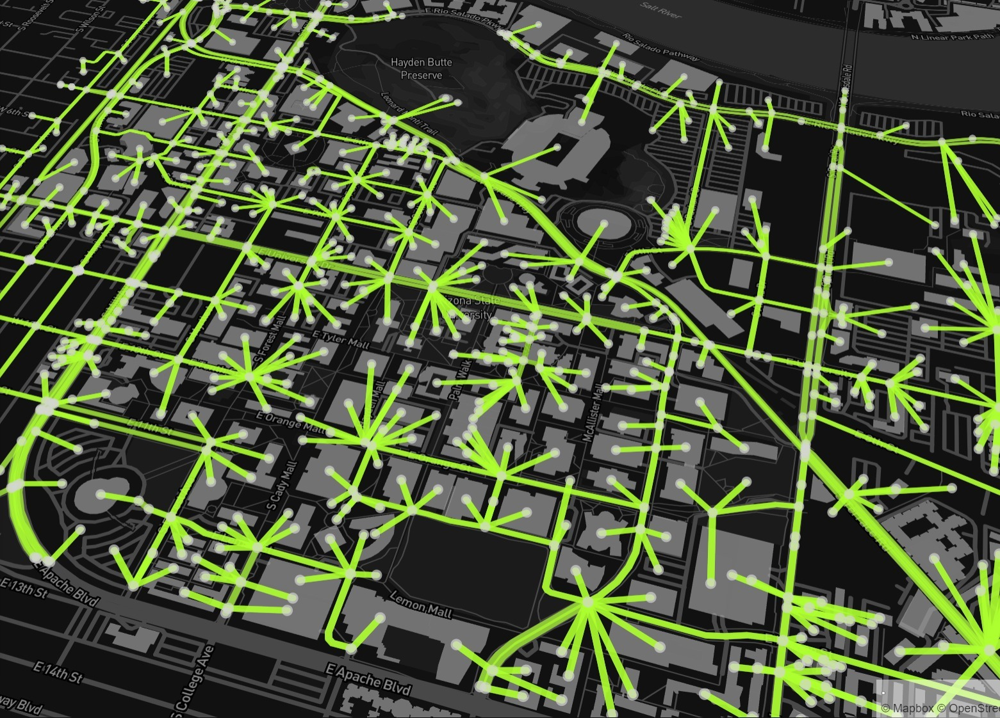
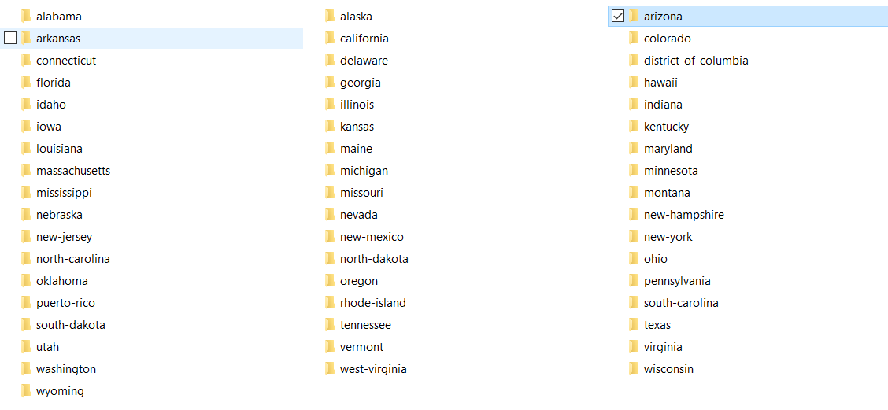
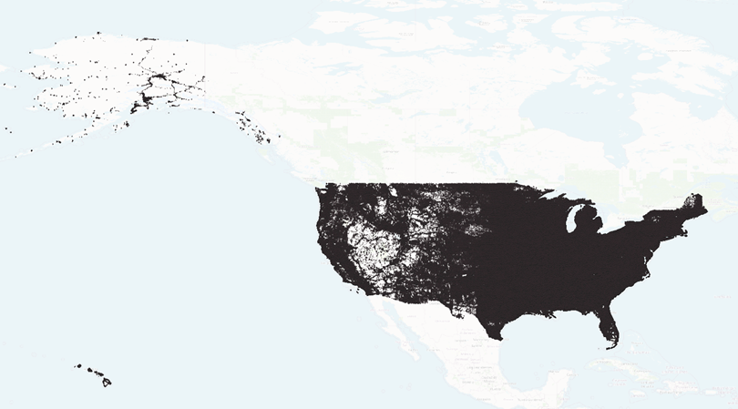
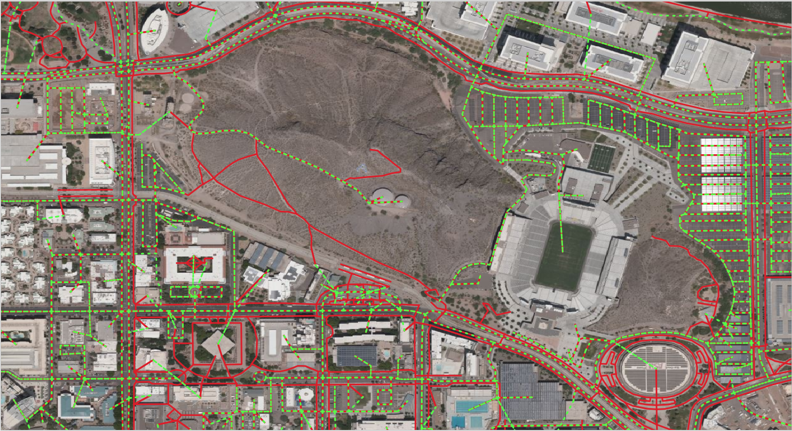

# asu-trans-ai-lab.github.io

The [General Modeling Network Specification
(GMNS)](https://github.com/zephyr-data-specs/GMNS) defines a common human and
machine readable format for sharing routable road network files.

By simply uploading node.csv and link.csv at
<https://asu-trans-ai-lab.github.io/index.html#/>, you can easily create custom
[online maps](https://en.wikipedia.org/wiki/Online_maps) for any GMNS network
files.

Sample node and link files for the above Arizona State University campus can be
found at
[here](https://github.com/asu-trans-ai-lab/integrated_modeling_GMNS/tree/main/examples/university_campus/Arizona_State_University).
You can contribute your data set for other beautiful [university
campuses](https://github.com/asu-trans-ai-lab/integrated_modeling_GMNS/tree/main/examples/university_campus/Arizona_State_University).
If you are interested in large-scale network modeling, please fetch the
[state-by-state transportation network
data](https://github.com/asu-trans-ai-lab/integrated_modeling_GMNS/tree/main/examples/United_States_network/motorway/states)
in the United States, in four different layers (motorway, trunk, primary and
secondary roads). The network data are converted from Openstreet map to GMNS
format using the [OSM2GMNS](https://pypi.org/project/osm2gmns/) python package
our team develop.

Categories of OpenStreetMap road network: Source:
https://wiki.openstreetmap.org/wiki/Map_features

| Motorway  | A restricted access major divided highway, normally with 2 or more running lanes plus emergency hard shoulder. Equivalent to the Freeway, Autobahn, etc. |
|-----------|----------------------------------------------------------------------------------------------------------------------------------------------------------|
| Trunk     | The most important roads in a country's system that aren't motorways. (Need not necessarily be a divided highway.)                                       |
| Primary   | The next most important roads in a country's system. (Often link larger towns.)                                                                          |
| Secondary | The next most important roads in a country's system. (Often link towns.)                                                                                 |

Our team is devoted to developing enterprise grade open-source tools for
transportation modeling, in a broader context of computational transportation
science. Please visit our website for integrated Analysis, Modeling and
Simulation ([AMS](https://github.com/asu-trans-ai-lab/integrated_modeling_GMNS))
and related [FHWA AMS data hub
effort](https://www.fhwa.dot.gov/publications/research/operations/13036/004.cfm).

Using [ASU research computing
facility](https://cores.research.asu.edu/research-computing/about), we also
create an entire U.S. driving network from OpenStreetMap with 20 million nodes.
The multi-modal network of ASU Tempe Campus can be found
[here](https://github.com/asu-trans-ai-lab/GTFS2GMNS/tree/main/walk_and_bike/Tempe-bike)
([Walk](https://github.com/asu-trans-ai-lab/GTFS2GMNS/tree/main/walk_and_bike/Tempe-walk):
red;
[Bike](https://github.com/asu-trans-ai-lab/GTFS2GMNS/tree/main/walk_and_bike/Tempe-bike):
green)

Please join us at smartcityplanning.slack.com to volunteer, or provide comments
to our ASU Trans+AI [team members](mailto:xzhou74@asu.edu).
